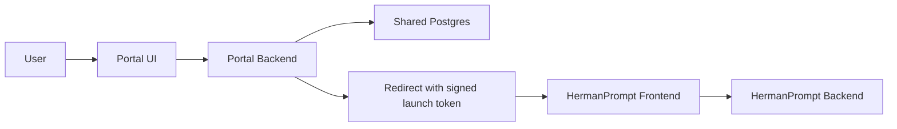

**Herman Portal Build Spec**

## 1. Purpose

Build a login portal that:

- authenticates users with `email + password`
- supports invitation acceptance with initial password setup
- supports password reset
- supports password change
- maps each authenticated user to the correct `user_id_hash`
- redirects directly into HermanPrompt with a signed launch token
- uses the same Postgres database as HermanPrompt and Herman Admin
- consumes tenant branding and invitation data written by Herman Admin

## 2. Product Goal

After successful login or invitation acceptance, a user should be redirected into HermanPrompt already authenticated at the app boundary.

The default login message is:

`Welcome to Herman Prompt. Please login to begin.`

However, Herman Portal must override the logo and welcome message when tenant-specific values exist in the shared admin-owned config.

## 3. Repos And Boundaries

### Repo
`herman_portal`

### Existing repo dependencies
- HermanPrompt frontend/backend repo
- Herman Admin repo
- shared Postgres database already used by HermanPrompt

### Ownership
Portal owns:
- login UI
- invitation acceptance UI
- initial password setup UI
- password reset UI
- password change UI
- auth credential logic
- launch token minting

Herman Admin owns:
- tenant portal configuration data
- invitation creation and invitation send
- invitation resend and revoke behavior
- org setup for logo URL and welcome message

HermanPrompt owns:
- app session bootstrap
- conversations
- feedback
- Prompt Transformer orchestration

## 4. Shared Data Contract

Herman Portal must use the admin-owned shared data contract documented in:

- `docs/ADMIN_TOOL_DATA_CONTRACT.md`

The key required tables are:

- `auth_users`
- `tenant_portal_configs`
- `user_invitations`
- `auth_user_credentials`
- `auth_sessions`

### Required interpretation

- `auth_users` is the source of truth for users
- `tenant_portal_configs` controls portal logo and welcome message
- `user_invitations` controls invite acceptance state and expiry
- invitation TTL is 7 days and is enforced via `expires_at`
- raw invite tokens are never stored, only token hashes

## 5. High-Level Flow

### Login flow
1. User opens `/login`.
2. Portal resolves tenant context when available.
3. Portal loads `tenant_portal_configs` for branding.
4. User enters email and password.
5. Backend validates credentials against shared Postgres.
6. Backend loads `user_id_hash` from `auth_users`.
7. Backend signs launch token.
8. Frontend redirects browser to HermanPrompt with `launch_token`.

### Invitation flow
1. User opens `/invite?token=<raw-token>`.
2. Portal hashes the token and looks up `user_invitations`.
3. Portal verifies invitation state, expiry, and revocation.
4. Portal loads tenant branding from `tenant_portal_configs`.
5. Portal renders logo and welcome message.
6. User sets initial password.
7. Portal writes `auth_user_credentials`.
8. Portal marks the invitation accepted.
9. Portal signs launch token and redirects into HermanPrompt.

### Password reset flow
1. User clicks `Forgot password`.
2. User submits email.
3. Backend creates reset token.
4. In dev mode, reset link may be returned or logged.
5. User opens reset link.
6. User submits new password.
7. Backend validates token and updates password hash.

## 6. Functional Requirements

### FR1. Login page
The portal must provide a login screen with:
- tenant logo when configured
- tenant welcome message when configured
- email input
- password input
- login button
- forgot password link
- inline error display

### FR2. Invitation page
The portal must provide an invitation acceptance screen at `/invite` with:
- tenant logo when configured
- tenant welcome message when configured
- invited email address
- new password input
- confirm password input
- clear invitation error states

### FR3. Credential validation
The backend must:
- locate user by normalized email
- verify password against stored password hash
- reject inactive users
- update `last_login_at` on success

### FR4. Invitation validation
The backend must:
- hash the raw token from the query string
- locate the matching `user_invitations` row
- reject invalid, expired, revoked, or already-consumed invitations
- treat `expires_at` as authoritative

### FR5. Initial password setup
On valid invitation acceptance, backend must:
- validate password policy
- write secure password hash to `auth_user_credentials`
- set `password_set_at`
- mark invitation accepted
- activate the user if required

### FR6. Launch token minting
On successful login or invitation acceptance, backend must sign a launch token compatible with HermanPrompt.

Required claims:
- `external_user_id`
- `display_name`
- `tenant_id`
- `user_id_hash`
- `exp`

### FR7. Redirect to HermanPrompt
After successful login or invitation acceptance, the portal must redirect user directly to HermanPrompt.

### FR8. Forgot password
Portal must support initiating password reset by email.

### FR9. Reset password
Portal must support setting a new password from a valid reset token.

### FR10. Change password
Portal must support changing password with the current password.

## 7. Non-Functional Requirements

### NFR1. Production-shaped auth
- hashed passwords only
- expiring reset tokens
- expiring invitation tokens
- signed launch tokens
- no plaintext credentials

### NFR2. Shared DB compatibility
The portal tables must coexist safely with HermanPrompt and Herman Admin schema.

### NFR3. Admin-owned branding
The portal must not introduce its own separate admin-managed branding store for logo and welcome message.

## 8. Database Requirements

### Existing source-of-truth table: `auth_users`
Fields used by the portal:
- `email`
- `user_id_hash`
- `display_name`
- `tenant_id`
- `is_active`

### Admin-owned table: `tenant_portal_configs`
Fields consumed by the portal:
- `tenant_id`
- `portal_base_url`
- `logo_url`
- `welcome_message`
- `is_active`

### Admin-owned table: `user_invitations`
Fields consumed by the portal:
- `user_id_hash`
- `tenant_id`
- `email`
- `invite_token_hash`
- `status`
- `expires_at`
- `accepted_at`
- `revoked_at`

### Portal-owned table: `auth_user_credentials`
Fields required:
- `user_id_hash`
- `password_hash`
- `password_algorithm`
- `password_set_at`
- `failed_login_attempts`
- `locked_until`
- `last_login_at`

### Portal-owned table: `auth_sessions`
Use this for refresh/session persistence or revocation state if the implementation needs database-backed session tracking.

## 9. Routes

Required portal frontend routes:
- `/login`
- `/invite`
- `/forgot-password`
- `/reset-password`
- `/change-password`

## 10. Acceptance Criteria

The build is complete when:

- a user can log in with email/password through the portal
- a valid invitation link opens `/invite`
- `/invite` reads tenant logo and welcome message from admin-owned config
- invitation acceptance enforces the 7-day TTL from `expires_at`
- invitation acceptance creates initial credentials successfully
- successful login or invitation acceptance redirects into HermanPrompt with a valid launch token
- auth data is stored in the shared Postgres database without creating a second identity source of truth
