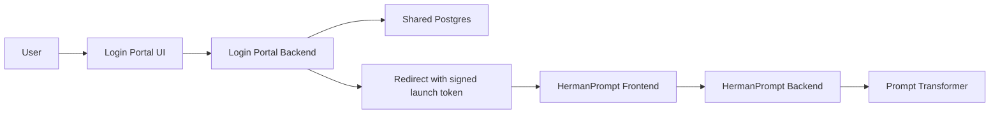

**Herman Login Portal Build Spec**

## 1. Purpose

Build a temporary standalone login portal that:

- authenticates users with `email + password`
- supports password reset
- supports password change
- maps each authenticated user to the correct `user_id_hash`
- redirects directly into HermanPrompt with a signed launch token
- uses the same Postgres database as HermanPrompt
- leaves clean hooks for a future Herman admin portal to add, change, deactivate, or delete users

This portal is a temporary stand-in for the kind of signed-launch authentication flow Softr can support.

## 2. Product Goal

After successful login, a user should be redirected into HermanPrompt already authenticated at the app boundary.

User-facing login message:

`Welcome to Herman Prompt. Please login to begin.`

## 3. Repos And Boundaries

### New repo
`herman-login-portal`

### Existing repo dependencies
- HermanPrompt frontend/backend repo
- shared Postgres database already used by HermanPrompt

### Ownership
Portal owns:
- login UI
- password reset UI
- password change UI
- auth tables and auth logic
- launch token minting

HermanPrompt owns:
- app session bootstrap
- conversations
- feedback
- Prompt Transformer orchestration

## 4. High-Level Flow



### Login flow
1. User opens portal login page.
2. User enters email and password.
3. Portal backend validates credentials against shared Postgres.
4. Backend loads mapped `user_id_hash`.
5. Backend signs launch token.
6. Frontend redirects browser to HermanPrompt with `launch_token`.
7. HermanPrompt backend validates token and establishes app session.

### Password reset flow
1. User clicks `Forgot password`.
2. User submits email.
3. Backend creates reset token.
4. In dev mode, reset link is returned/logged.
5. User opens reset link.
6. User submits new password.
7. Backend validates token and updates password hash.

### Password change flow
1. User opens the password change screen.
2. User provides current password and new password.
3. Backend verifies the current password.
4. Backend updates the stored password hash and `password_changed_at`.

## 5. Shared Database Strategy

Use the same Postgres database as HermanPrompt.

### Why
- one source of truth for identity -> `user_id_hash`
- no sync drift
- simpler local testing
- easier future admin tooling

### Rule
The database becomes the authoritative mapping source for:
- `email`
- auth user identity
- `user_id_hash`

## 6. Functional Requirements

### FR1. Login page
The portal must provide a login screen with:
- heading text: `Welcome to Herman Prompt. Please login to begin.`
- email input
- password input
- login button
- forgot password link
- inline error display

### FR2. Credential validation
The backend must:
- locate user by normalized email
- verify password against stored password hash
- reject inactive users
- update `last_login_at` on success

### FR3. Launch token minting
On successful login, backend must sign a launch token compatible with HermanPrompt.

Required claims:
- `external_user_id`
- `display_name`
- `tenant_id`
- `user_id_hash`
- `exp`

### FR4. Redirect to HermanPrompt
After successful login, the portal must redirect user directly to HermanPrompt.

Example:
`http://localhost:5173/?launch_token=<signed-token>`

### FR5. Forgot password
Portal must support initiating password reset by email.

### FR6. Reset password
Portal must support setting a new password from a valid reset token.

### FR7. Dev-friendly reset delivery
In development:
- reset link may be logged or returned in API response
- real email delivery is not required for v1

### FR8. Change password
Portal must support changing password with the current password.

Temporary portal implementation may use:
- authenticated portal session
- or a re-authenticated form that includes email, current password, and new password

### FR9. Admin hooks
Backend must include service layer and route placeholders for future admin actions:
- add user
- update user
- deactivate user
- delete user
- reset user password
- remap `user_id_hash`

## 7. Non-Functional Requirements

### NFR1. Temporary but production-shaped
The portal can be minimal, but auth logic should follow production-safe patterns:
- hashed passwords
- expiring reset tokens
- signed launch tokens
- no plaintext credentials

### NFR2. Shared DB compatibility
The new tables must coexist safely with HermanPrompt schema.

### NFR3. Clear upgrade path
The design should support later replacement by:
- Softr
- dedicated auth provider
- real admin portal

## 8. Recommended Stack

### Backend
- FastAPI
- SQLAlchemy
- Alembic
- `passlib[bcrypt]` for password hashing

### Frontend
- Vite
- React
- TypeScript

### Database
- Postgres shared with HermanPrompt

## 9. Database Schema

### Table: `auth_users`

Fields:
- `id` UUID or integer primary key
- `email` string unique not null
- `password_hash` string not null
- `user_id_hash` string not null
- `display_name` string nullable
- `tenant_id` string not null default `tenant_demo`
- `is_active` boolean not null default true
- `is_admin` boolean not null default false
- `created_at` timestamp not null
- `updated_at` timestamp not null
- `last_login_at` timestamp nullable
- `password_changed_at` timestamp nullable

Indexes:
- unique index on `email`
- index on `user_id_hash`

### Table: `password_reset_tokens`

Fields:
- `id` UUID or integer primary key
- `user_id` foreign key to `auth_users.id`
- `token_hash` string not null
- `expires_at` timestamp not null
- `used_at` timestamp nullable
- `created_at` timestamp not null

Indexes:
- index on `user_id`
- index on `expires_at`

### Optional future table: `auth_audit_log`
Not required in v1.

## 10. API Spec

### `GET /api/health`
Response:
```json
{"status":"ok"}
```

### `POST /api/auth/login`
Request:
```json
{
  "email": "jane@example.com",
  "password": "secret123"
}
```

Success response:
```json
{
  "launch_token": "<signed-token>",
  "redirect_url": "http://localhost:5173/?launch_token=<signed-token>"
}
```

Error responses:
- `401` invalid credentials
- `403` inactive user
- `400` malformed payload

### `POST /api/auth/forgot-password`
Request:
```json
{
  "email": "jane@example.com"
}
```

Success response:
```json
{
  "status": "accepted"
}
```

Dev-only optional response:
```json
{
  "status": "accepted",
  "reset_url": "http://localhost:5174/reset-password?token=..."
}
```

Important:
- always return success-like response even if email does not exist

### `POST /api/auth/reset-password`
Request:
```json
{
  "token": "<reset-token>",
  "new_password": "newStrongPassword123"
}
```

Response:
```json
{
  "status": "password_reset"
}
```

Error responses:
- `400` invalid token
- `400` expired token
- `400` already used token

### `POST /api/auth/change-password`
Request:
```json
{
  "email": "jane@example.com",
  "current_password": "oldSecret123",
  "new_password": "newSecret456"
}
```

Response:
```json
{
  "status": "password_changed"
}
```

Error responses:
- `401` invalid credentials
- `403` inactive user
- `400` malformed payload

### Future admin routes
Implement as placeholders or protected stubs:

- `POST /api/admin/users`
- `PATCH /api/admin/users/{id}`
- `DELETE /api/admin/users/{id}`
- `POST /api/admin/users/{id}/reset-password`
- `POST /api/admin/users/{id}/deactivate`

## 11. Launch Token Contract

Portal backend signs token with shared secret.

Recommended payload:
```json
{
  "external_user_id": "auth_user:42",
  "display_name": "Jane Doe",
  "tenant_id": "tenant_demo",
  "user_id_hash": "user_1",
  "exp": 1779999999
}
```

### Requirements
- HMAC signing compatible with HermanPrompt validation logic
- TTL default: 1 hour
- token must include `user_id_hash`

## 12. HermanPrompt Integration Requirement

HermanPrompt must accept the signed `user_id_hash` claim from the portal-issued launch token after validating the signature.

That is the required contract for this portal.

## 13. Frontend Requirements

### Routes
- `/login`
- `/forgot-password`
- `/reset-password`
- `/change-password`

### Login page requirements
- heading text
- email/password form
- submit button
- loading state
- invalid credentials error
- forgot password link

### Forgot password page
- email input
- submit button
- success confirmation text

### Reset password page
- new password
- confirm password
- submit button
- success confirmation and link back to login

### Change password page
- email input for temporary re-authenticated flow
- current password
- new password
- confirm new password
- submit button
- success confirmation

### Redirect behavior
On successful login:
- immediate browser redirect to `redirect_url`

## 14. Repo Structure

```text
herman-login-portal/
  backend/
    app/
      api/
        routes_auth.py
        routes_admin.py
        __init__.py
      core/
        config.py
        security.py
        __init__.py
      db/
        base.py
        session.py
        __init__.py
      models/
        auth_user.py
        password_reset_token.py
        __init__.py
      schemas/
        auth.py
        admin.py
        __init__.py
      services/
        auth_service.py
        password_reset_service.py
        admin_user_service.py
        launch_token_service.py
        __init__.py
      main.py
    alembic/
    requirements.txt
    .env.example
  frontend/
    src/
      pages/
        LoginPage.tsx
        ForgotPasswordPage.tsx
        ResetPasswordPage.tsx
        ChangePasswordPage.tsx
      lib/
        api.ts
      App.tsx
      main.tsx
    package.json
    .env.example
  README.md
  docs/
    BUILD_SPEC.md
```

## 15. Environment Variables

### Backend
- `DATABASE_URL`
- `PORT`
- `HOST`
- `LOG_LEVEL`
- `HERMANPROMPT_UI_URL`
- `HERMANPROMPT_LAUNCH_SECRET`
- `LAUNCH_TOKEN_TTL_SECONDS`
- `PASSWORD_RESET_TOKEN_TTL_SECONDS`
- `DEV_SHOW_RESET_LINKS`
- `CORS_ALLOWED_ORIGINS`

### Frontend
- `VITE_API_BASE_URL`

## 16. Security Rules

- passwords must be stored only as hashes
- reset tokens must be stored hashed, not plaintext
- reset tokens must expire
- reset tokens must be single-use
- login error responses must not reveal whether email exists
- forgot-password response must not reveal whether email exists
- launch tokens must be short-lived
- no plaintext password logging

## 17. Seed And Admin Hooks

### Required seed utilities
Backend should include CLI or script support for:
- create user
- set password
- deactivate user
- remap `user_id_hash`

Examples:
- `python -m app.scripts.create_user`
- `python -m app.scripts.reset_password`

UI for admin is not required in v1.

## 18. Implementation Phases

### Phase 1. Scaffold
- create backend/frontend apps
- health endpoint
- login page UI shell

### Phase 2. Auth schema
- add Alembic migration
- create `auth_users`
- create `password_reset_tokens`

### Phase 3. Login backend
- password hashing
- login endpoint
- launch token signing
- redirect URL generation

### Phase 4. Password reset
- forgot-password endpoint
- reset-password endpoint
- reset token storage and validation

### Phase 5. Frontend flows
- login page
- forgot password page
- reset password page
- success/error states
- redirect into HermanPrompt

### Phase 6. Admin hooks
- service layer
- route stubs or protected endpoints
- local scripts

### Phase 7. End-to-end integration
- portal login -> HermanPrompt redirect
- HermanPrompt bootstrap
- prompt profile loads correctly through `user_id_hash`

## 19. Test Plan

### Backend tests
- valid login returns launch token
- invalid password returns `401`
- inactive user returns `403`
- forgot-password returns accepted response
- reset token expires correctly
- used token cannot be reused
- token contains expected `user_id_hash`

### Frontend tests
- login page renders correct message
- login success redirects
- login failure shows error
- forgot-password success state renders
- reset-password success state renders

### Manual tests
1. create user with email mapped to `user_1`
2. log in
3. confirm redirect into HermanPrompt
4. send prompt in HermanPrompt
5. confirm behavior/profile corresponds to `user_1`
6. request password reset
7. reset password
8. log in with new password
9. confirm old password no longer works
10. change password with current password
11. confirm prior password no longer works

## 20. Acceptance Criteria

The feature is complete when:
- a user can log in with email/password through the new portal
- the portal redirects into HermanPrompt with a signed launch token
- HermanPrompt accepts the token and starts the app normally
- the correct `user_id_hash` is used
- password reset works end to end
- password change works end to end
- auth data is stored in the shared Postgres database
- future admin hooks exist in backend structure or protected endpoints
